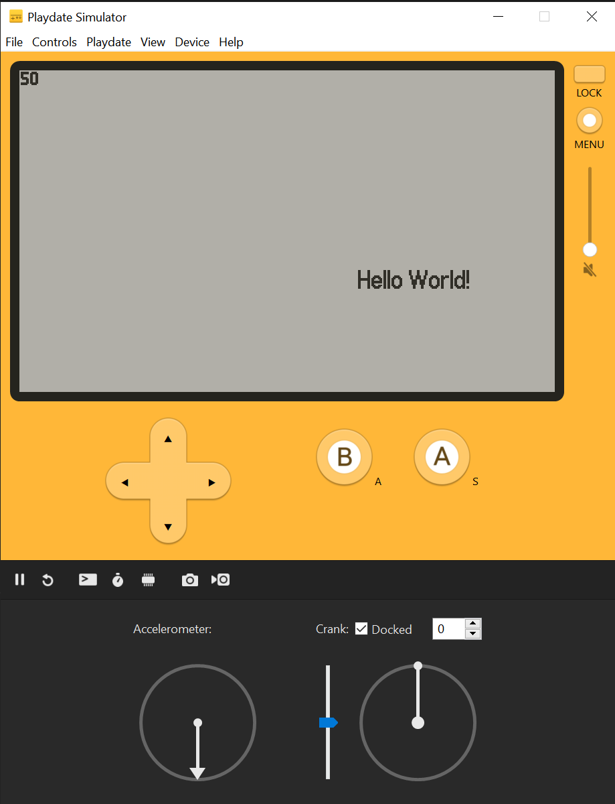

# Playdate hello world in Odin

A small hello world app from the Playdate C examples, using the Odin language.

Only tested on Windows/Mac at the moment, but should probably work on Linux by making a similar build file.

## How to use

- Install the [Playdate SDK](https://play.date/dev/) (2.0.3) and make sure you have a `PLAYDATE_SDK_PATH` environment variable.
- Run `win64_build.bat` or `macos_build.bat`.

This should build the game (into the `Source` folder) and run it into the Playdate simulator.

